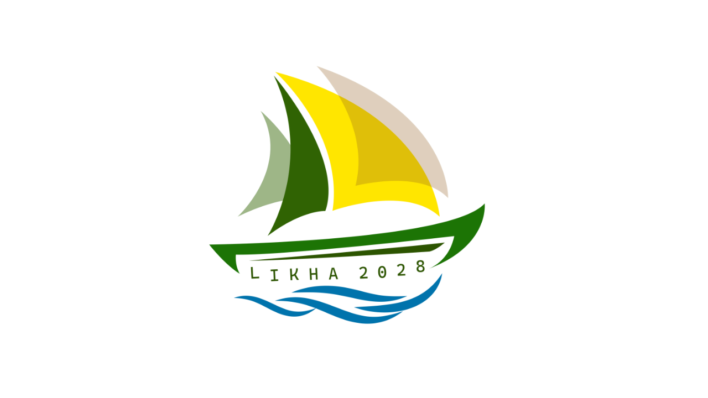

<h1>Manlayag</h1>

**CARSU's Learning Management System powered by Frappe Learning**

## Manlayag

**Manlayag** is the official Learning Management System (LMS) of **Caraga State University (CARSU)**. It provides a centralized platform for delivering online courses, training programs, learning resources, assessments, and certifications for students, faculty, staff, and partner institutions.

Built on the open-source **Frappe Learning** platform, Manlayag extends and customizes its features to support the university's digital learning initiatives, flexible learning programs, extension activities, and lifelong learning opportunities.

### Purpose

The name *Manlayag* (to sail or navigate) reflects the university's commitment to guiding learners through their educational journey by providing accessible, structured, and technology-enabled learning experiences.

The platform enables instructors and administrators to:

* Create and manage online courses
* Organize lessons, chapters, quizzes, and assignments
* Conduct synchronous and asynchronous learning activities
* Track learner progress and completion
* Issue certificates and credentials
* Deliver training and extension programs to various stakeholders

### Key Features

* **Structured Learning Paths**

  * Organize learning content into Courses, Chapters, and Lessons for a guided learning experience.

* **Online Assessments**

  * Create quizzes, assignments, and evaluations to measure learner achievement and competency.

* **Live and Self-Paced Learning**

  * Support both instructor-led and self-paced learning modalities.

* **Batch and Cohort Management**

  * Group learners into batches for training programs, academic offerings, and extension activities.

* **Progress Tracking**

  * Monitor learner engagement, completion rates, and assessment performance.

* **Certification**

  * Generate certificates for course and training completion.

* **Responsive User Experience**

  * Access courses from desktop, tablet, and mobile devices.

## CARSU Custom Enhancements

The CARSU (Caraga State University) implementation of Manlayag introduces several custom features and platform optimizations:

### 1. Advanced Student & Cohort Management
* **Comprehensive Students Cohort View**: A dedicated "Students" tab on the Batches Page displaying all system-wide student accounts.
* **Advanced Filtering & Sorting**: Filter students by search term or assigned batches, including a custom "Without Batch" filter option to isolate unassigned users.
* **Quick Batch Assignment**: Inline actions to instantly assign unassigned students to batches using a dynamic modal.
* **Visual Account Status Indicators**: Disabled student accounts are visually dimmed in the table list.
* **Bulk Actions Banner**: Convenient selection-based actions to handle multiple cohort members simultaneously.
* **Toggle Switch Bulk Controls**: A modern, dynamic toggle switch in the bulk action bar showing whether the selected cohort accounts are active or disabled, with full toggle support.
* **Action Toast Notifications**: Modern toast alerts confirming successful completion of all cohort adjustments (adds, unenrollments, and status updates).

### 2. Proctoring & Progression Controls
* **Full-Screen Enforcement**: Secure proctoring settings that enforce full-screen view during critical quizzes.
* **Tab/Window Focus Monitoring**: Tracks focus loss or tab navigation to ensure quiz integrity.
* **Checkpoint & Graded Quizzes**: Controls course progression by locking the "Next Lesson" button until mandatory quizzes are completed.

### 3. Video-Embedded Interactive Quizzes (Quiz-in-Video)
* **Timestamp-Based Popups**: Pauses lesson videos at designated timestamps to challenge learners with embedded quizzes.
* **Interactive Management Modals**: Tools to specify exact video seconds, questions, and responses for quizzes in videos.

### 4. Interactive & Accessible Lesson Layout
* **Synced Video Transcripts**: Displays interactive text transcripts side-by-side with lesson videos, allowing students to click text snippets to seek directly to that part of the video.
* **CodeBox Theme Selector**: LocalStorage-synced light/dark theme switch for code snippets inside lessons, automatically refreshing HighlightJS stylesheets dynamically.

### 5. Performance & Scalability Enhancements
* **High-Concurrency Rate Limiting**: Optimized API rate-limit thresholds and throttling properties in `utils.py` to seamlessly handle 1,000+ concurrent active sessions.

### 6. Interactive Programming Exercises
* **C & C++ Code Highlighting**: Full coding support for C and C++ with real-time syntax highlighting to help students write and debug code directly in their web browser.
* **Separate Run and Submit Options**: Students can run their code as many times as they want to verify they pass local test cases before officially submitting their work for grading.
* **Multiline Input & Output Test Cases**: Supports complex test cases with multiple lines of input and expected output, allowing instructors to test advanced programming scenarios.
* **Formatted Output Display**: Code console output retains its formatting (including newlines and spaces) so students can easily compare their program's result with the expected test case output.

### 7. Unified Activity Editor & Grading Policies
* **Consolidated Activity Editing**: Selecting to edit any activity automatically enables all interactive block tools (quizzes, assignments, and programming exercises) so instructors can customize the lesson's content in a single screen.
* **Context-Aware Save Success Alerts**: System notifies instructors with content-specific confirmation alerts ("Activity updated successfully" vs. "Lesson updated successfully") to reflect what type of content was saved.
* **Unified Grading & Deadline Options**: All assignments and programming exercises support the same grading configuration options as quizzes. Instructors can toggle whether the work is graded, assign it to a specific course grading category, and set clear due dates and times.

### Acknowledgements

Manlayag is built upon the excellent work of the Frappe community and the Frappe Learning project.

Special thanks to:

* [Frappe Learning](https://github.com/frappe/lms?utm_source=chatgpt.com)
* [Frappe Framework](https://github.com/frappe/frappe?utm_source=chatgpt.com)
* [Frappe Technologies Pvt. Ltd.](https://frappe.io?utm_source=chatgpt.com)

Manlayag includes customizations and enhancements developed by Caraga State University while retaining and respecting the original open-source licensing and contributions of the Frappe ecosystem.

### Under the Hood

* **Frappe Learning** – Open-source Learning Management System.
* **Frappe Framework** – Full-stack web application framework.
* **Frappe UI** – Modern Vue.js-based user interface library.

### Copyright and License

Manlayag is a customized implementation of Frappe Learning.

Copyright © Caraga State University

This project incorporates software from the Frappe Learning project and remains subject to the applicable open-source licenses of its upstream dependencies.

Please refer to the LICENSE files of the respective upstream projects for complete licensing information.
